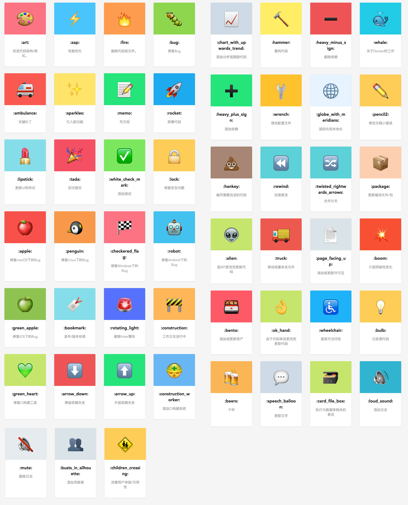

转自：http://www.ruanyifeng.com/blog/2016/01/commit_message_change_log.html

参考：http://yanhaijing.com/git/2016/02/17/my-commit-message/

http://blog.minfive.com/2017/09/08/2017-09-08-git-commit-message/index.html


# Commit message 编写指南 [规范]

[TOC]


Git 每次提交代码，都要写 Commit message（提交说明），否则就不允许提交。

```bash
$ git commit -m "hello world"
```

上面代码的`-m`参数，就是用来指定 commit mesage 的。

如果一行不够，可以只执行`git commit`，就会跳出文本编辑器，让你写多行。

其实 `commit message` 你写什么都行，但是，一般来说，commit message 应该清晰明了，说明本次提交的目的。


## Commit message 格式

每次提交，Commit message 都包括三个部分：`Header`，`Body` 和 `Footer`。

```bash
<type>(<scope>): <subject>
// 空一行
<body>
// 空一行
<footer>
```


```
# 标题行：50个字符以内，描述主要变更内容
#
# 主体内容：更详细的说明文本，建议72个字符以内。 需要描述的信息包括:
#
# * 为什么这个变更是必须的? 它可能是用来修复一个bug，增加一个feature，提升性能、可靠性、稳定性等等
# * 他如何解决这个问题? 具体描述解决问题的步骤
# * 是否存在副作用、风险? 
#
# 尾部：如果需要的化可以添加一个链接到issue地址或者其它文档，或者关闭某个issue。
```


其中，Header 是必需的，Body 和 Footer 可以省略。

不管是哪一个部分，任何一行都不得超过72个字符（或100个字符）。这是为了避免自动换行影响美观。


### 1. Header

Header部分只有一行，包括三个字段：`type`（必需）、`scope`（可选）和`subject`（必需）。

#### 1.1 type

`type`用于说明 commit 的类别，可以使用如下类别

 - feat：新增功能 (feature)
 - fix：修复bug
 - docs：文档 (Documentation)
 - style：格式 (不影响代码运行的变动，比如空格、分号等)
 - refactor：重构 (既不是新增功能，也不是修改bug的代码变动)
 - perf：优化 (提高性能和体验的代码变动)
 - test：增加测试 (包括单元测试，集成测试等)
 - build: 构建工具或外部依赖的更改 (npm webpack gulp等)
 - ci：项目级的配置文件和脚本的更改
 - chore：构建流程或辅助工具的变动(不会修改src或测试文件)
 - revert：撤销(回滚到上一个版本的提交)

如果`type`为`feat`和`fix`，则该 commit 将肯定出现在 Change log 之中。其他情况（`docs`、`chore`、`style`、`refactor`、`test`）由你决定，要不要放入 Change log，建议是不要。

> 使用 `revert` 标识撤销 commit 时，`subject` 应为所撤销的 commit 的 message， Body 应包含 所撤销的 commit 的 hash。
>
> 格式如下：

```
revert: feat(pencil): add 'graphiteWidth' option

This reverts commit 667ecc1654a317a13331b17617d973392f415f02.
```

#### 1.2 scope

`scope`用于说明 commit 影响的范围，比如数据层、控制层、视图层等等，视项目不同而不同。

#### 1.3 subject

`subject`是 commit 目的的简短描述，不超过50个字符。

 - 以动词开头，使用第一人称现在时，比如change，而不是changed或changes
 - 第一个字母小写
 - 结尾不加句号（.）


### 2. Body

Body 部分是对本次 commit 的详细描述，可以分成多行。下面是一个范例

```
More detailed explanatory text, if necessary.  Wrap it to 
about 72 characters or so. 

Further paragraphs come after blank lines.

- Bullet points are okay, too
- Use a hanging indent
```

**注意：**应该说明代码变动的动机，以及与以前行为的对比。

### 3. Footer

Footer 部分只用于两种情况。

- 重大的不兼容改动: 用于给出改动说明及解决方案
- 关联 issues: 用于关闭相应 issues

#### 3.1 关联 Issue

本次提交如果和摸个issue有关系则需要写上这个，格式如下：

```
Issue #1, #2, #3
```


#### 3.2 关闭 Issue

如果当前提交信息解决了某个issue，那么可以在 Footer 部分关闭这个 issue，关闭的格式如下：

```bash
Closes #234

# 也可以一次关闭多个 issue
Closes #123, #245, #992
```


### 实例

下面是一个完整的例子：

```
feat: 添加了分享功能

给每篇博文添加了分享功能

- 添加分享到微博功能
- 添加分享到微信功能
- 添加分享到朋友圈功能

Issue #1, #2
Close #1
```


## 高效使用

上边介绍了如何按规范写 commit message，利用工具可以更高效的使用这套规范。

1. [Commitizen](https://github.com/commitizen/cz-cli) ：是一个撰写合格 Commit message 的工具
2. [validate-commit-msg](https://github.com/kentcdodds/validate-commit-msg) ：用于检查 Node 项目的 Commit message 是否符合格式。


## emoji 表情

在 github 提交代码时加入 emoji 表情感觉是件很有趣的事情，不仅可以让提交记录能包含更多有用信息，也能提升阅读体验。

[开源项目 gitmoji](https://gitmoji.carloscuesta.me/) 专门规定了在 github 提交代码时应当遵循的 emoji 规范：

**gitmoji 项目：**

gitmoji官网：https://gitmoji.carloscuesta.me/  
Github仓库：https://github.com/carloscuesta/gitmoji/  





### emoji 指南

> 源自：https://github.com/liuchengxu/git-commit-emoji-cn/


emoji                                   | emoji 代码                   | commit 说明
:--------                               | :--------                    | :--------
:tada: (庆祝)                           | `:tada:`                     | 初次提交
:new: (全新)                            | `:new:`                      | 引入新功能
:bookmark: (书签)                       | `:bookmark:`                 | 发行/版本标签
:bug: (bug)                             | `:bug:`                      | 修复 bug
:ambulance: (急救车)                    | `:ambulance:`                | 重要补丁
:globe_with_meridians: (地球)           | `:globe_with_meridians:`     | 国际化与本地化
:lipstick: (口红)                       | `:lipstick:`                 | 更新 UI 和样式文件
:clapper: (场记板)                      | `:clapper:`                  | 更新演示/示例
:rotating_light: (警车灯)               | `:rotating_light:`           | 移除 linter 警告
:wrench: (扳手)                         | `:wrench:`                   | 修改配置文件
:heavy_plus_sign: (加号)                | `:heavy_plus_sign:`          | 增加一个依赖
:heavy_minus_sign: (减号)               | `:heavy_minus_sign:`         | 减少一个依赖
:arrow_up: (上升箭头)                   | `:arrow_up:`                 | 升级依赖
:arrow_down: (下降箭头)                 | `:arrow_down:`               | 降级依赖
:zap: (闪电)<br>:racehorse: (赛马)      | `:zap:`<br>`:racehorse:`      | 提升性能
:chart_with_upwards_trend: (上升趋势图) | `:chart_with_upwards_trend:` | 添加分析或跟踪代码
:rocket: (火箭)                         | `:rocket:`                   | 部署功能
:white_check_mark: (白色复选框)         | `:white_check_mark:`         | 增加测试
:memo: (备忘录)                         | `:memo:`                     | 撰写文档
:hammer: (锤子)                         | `:hammer:`                   | 重大重构
:art: (调色板)                          | `:art:`                      | 改进代码结构/代码格式
:fire: (火焰)                           | `:fire:`                     | 移除代码或文件
:pencil2: (铅笔)                        | `:pencil2:`                  | 修复 typo
:construction: (施工)                   | `:construction:`             | 工作进行中
:wastebasket: (垃圾桶)                  | `:wastebasket:`              | 废弃或删除
:wheelchair: (轮椅)                     | `:wheelchair:`               | 可访问性
:construction_worker: (工人)            | `:construction_worker:`      | 添加 CI 构建系统
:green_heart: (绿心)                    | `:green_heart:`              | 修复 CI 构建问题
:lock: (锁)                             | `:lock:`                     | 修复安全问题
:whale: (鲸鱼)                          | `:whale:`                    | Docker 相关工作
:apple: (苹果)                          | `:apple:`                    | 修复 macOS 下的问题
:penguin: (企鹅)                        | `:penguin:`                  | 修复 Linux 下的问题
:checkered_flag: (旗帜)                 | `:checkered_flag:`           | 修复 Windows 下的问题


### 如何在命令行中显示 emoji

默认情况下，在命令行中并不会显示出 emoji, 仅显示 emoji 代码。不过可以使用 [emojify](https://github.com/mrowa44/emojify) 使得在命令行也可显示 emoji, 它是一个 shell 脚本，安装与使用都很简单，在 [这里](https://github.com/mrowa44/emojify) 查看如何安装与使用。


### 参考

#### git commit emoji

- [gitmoji](https://github.com/carloscuesta/gitmoji/)
- [emoji-cheat-sheet](http://www.webpagefx.com/tools/emoji-cheat-sheet/)
- [styleguide-git-commit-message](https://github.com/slashsBin/styleguide-git-commit-message)
- [atom git commit messages guide](https://github.com/atom/atom/blob/master/CONTRIBUTING.md#git-commit-messages)
- [An emoji guide for your commit messages](https://gitmoji.carloscuesta.me/)
- [程序员提交代码的 emoji 指南——原来表情文字不能乱用](https://www.h5jun.com/post/gitmoji.html)
- [Ant Design 更新日志 emoji 规范](https://github.com/ant-design/ant-design/wiki/%E8%BD%AE%E5%80%BC%E8%A7%84%E5%88%99%E5%92%8C%E7%89%88%E6%9C%AC%E5%8F%91%E5%B8%83%E6%B5%81%E7%A8%8B#emoji-for-changelog)

#### write a good commit message

- [A Note About Git Commit Messages](http://tbaggery.com/2008/04/19/a-note-about-git-commit-messages.html)
- [How to write a Git Commit Message (2014)](https://news.ycombinator.com/item?id=13889155)
- [how to write a good git commit message](https://github.com/joelparkerhenderson/git_commit_message)
- [5 Useful Tips For A Better Commit Message](https://robots.thoughtbot.com/5-useful-tips-for-a-better-commit-message)
- [Udacity Git Commit Message Style Guide](http://udacity.github.io/git-styleguide/)
- [How to commit a change with both “message” and “description” from the command line?](https://stackoverflow.com/questions/16122234/how-to-commit-a-change-with-both-message-and-description-from-the-command-li)

